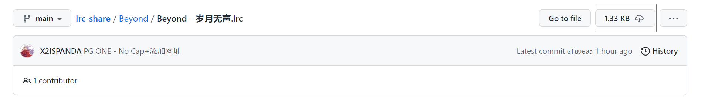
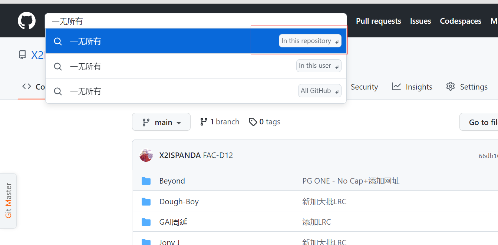
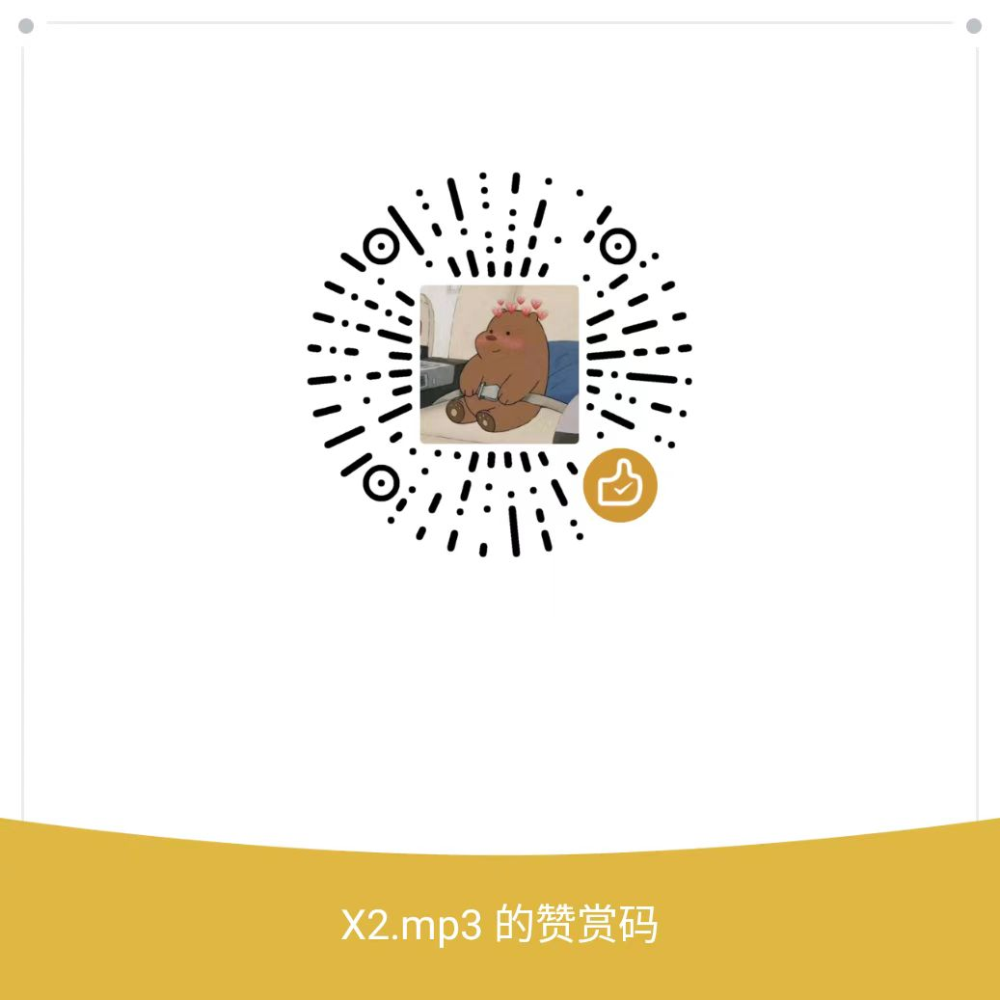

# lrc-share

本库所有歌词已经上传到<b>[lrcshare](https://lrcshare.com)</b>。欢迎到网站上进行查看。

这是一个<B>滚动歌词(.lrc)文件</B>分享库。 
主要收录一些中国大陆已下架或被禁的歌曲或者其他自己制作的滚动歌词。 
如果你也有制作滚动歌词的想法，推荐使用[滚动歌词姬](https://lrc-maker.github.io/#/)。 

<b>除了已下架或被禁而导致[音乐标签](https://www.cnblogs.com/vinlxc/p/11347744.html)不能自己找到而需要在互联网去寻找匹配的lrc和自己制作的互联网没有的lrc以外，请不要上传其余很好寻找和匹配的lrc，也不要上传重复的lrc，上传之前务必核对，十分感谢！</b>

欢迎大家加入QQ群(群号：335718163)，大部分LRC已经都放到群文件里了。也可以通过QQ群联系帮忙上传。

## 歌词制作教程
1. 手机端教程 https://www.bilibili.com/video/BV1Ls4y1h7EK/
2. 电脑端教程 https://www.bilibili.com/video/BV1gu4y1F7FN/

## 如何使用？
1. 第一种方法：复制歌词文件文本另存为与歌曲文件名.lrc，保持和你的歌曲文件同名并放到和你的歌曲同一个目录。例如：你的歌曲文件是<b>周杰伦 - 稻香.mp3</b>则应该保存为<b>周杰伦 - 稻香.lrc</b>。
2. 第二种方法：或者点击进你需要下载的歌词文件的页面后，点击这个图标可直接进行下载，然后再重命名保持和你的歌曲文件同名即可。 
3. 仓库快速检索如图：
4. 如果你的播放器(比如[Musicolet](https://krosbits.in/musicolet/),[椒盐音乐](https://github.com/Moriafly/SaltPlayerSource)等)支持读取歌曲标签，你也可以把该文本通过[音乐标签](https://www.cnblogs.com/vinlxc/p/11347744.html)直接复制到歌曲的歌词标签里即可出现滚动歌词。

## 注意事项
1. 本项目如有侵犯您的权利请及时联系我（xmy329@gmail.com）删除。
2. 本项目除了单纯的动态歌词分享无任何政治倾向，请不要因为有某些歌而进行无端揣测。
3. 本项目欢迎大家一起上传分享。如果不懂如何上传github的朋友可以直接发到我邮箱(xmy329@gmail.com)，我会帮忙上传。
4. 如果您是不知道这是什么东西的新手，请查阅[lrc格式](https://zh.wikipedia.org/wiki/LRC%E6%A0%BC%E5%BC%8F),再自行搜索如何使用。此文件并不能在QQ音乐，网易云音乐,Apple Music，Spotify，KKBOX等流媒体软件上直接使用，而是需要额外的本地音乐播放器。
5. <b>由于一首歌往往有多个版本，推送请根据歌手文件夹推送，最好文件添加歌曲时长([length])标签或者文件名标注版本，方便大家寻找,不会拿过去不能用。如果方便也可以在lrc中注明本库，方便大家知道这里，十分感谢。</b> 
6. 有需要帮忙制作的歌词可以发送文本歌词和音乐文件到xmy329@gmail.com，有时间会帮忙制作。 
7. 关于合作歌曲大部分都是随便选了其中一位歌手的文件夹放置，如果找不到可以去另一个歌手文件夹找。而且很大可能都是放在因为谁被下架了的文件夹里，比如邓紫棋和黄明志合唱的飘向北方就放在黄明志文件夹里。还有类似一个歌手有很多艺名的就放到一个文件夹中不另外建文件夹，比如红花会/黑怕不怕黑/404 RARPER。
8. 禁止收费有偿提供本库歌词。

## 参与贡献
<b>以下为提交歌词或者PR并合并的小伙伴（排名不分先后）：<b> 
玉溪谷/Ferech(贡献了中文说唱半壁江山)/mamepae/[Mr-233333](https://github.com/Mr-233333)/[C5732](https://github.com/C5732)/[Mumrab](http://music.163.com/artist?id=12968692&userid=103609335)/CYD(<b>@undaloop</b>歌词纠正)/[yskdr](https://space.bilibili.com/91756419)/离梦ansaski/敢问君子去何处/Parvati-IV/Act1ve/[Psynius](https://music.163.com/#/artist?id=54548162)(<b>@undaloop</b>歌词贡献)

感谢本项目LOGO设计:

患听/[Psynius](https://music.163.com/#/artist?id=54548162)

<b>以下为赞赏本歌词库的小伙伴（排名不分先后）：<b> 
特此鸣谢💓 ，感谢各位瓷的支持~ 🌹

| 赞助人     | 金额(元) | 赞助方式   | 备注                                                        |
| ---------- | -------- | ---------- | ----------------------------------------------------------- |
| 抽象的人儿 | 8.88     | 微信       |                                                             |
| 霍雨佳     | 1.00     | 微信       |                                                             |
| 卡喵       | 5.00     | 微信赞赏码 |                                                             |
| Psynius    | 7.00     | 微信       | 网易云音乐人主页:https://music.163.com/#/artist?id=54548162 |
| 张三       | 0.54     | QQ红包     |                                                             |
| 水蓝蓝     | 1.00     | 微信       |                                                             |
| 二水       | 1.00     | 微信       |                                                             |
| 小蒋       | 5.00     | 微信       |                                                             |
| ReledGroup | 5.00     | 微信       |                                                             |
| 小谷       | 3.00     | 微信       |                                                             |
| 故山白鹿   | 5.00     | 微信赞赏码 |                                                             |
| Act1ve     | 3.00     | 微信       |                                                             |
| 王镱翔     | 5.00     | 微信赞赏码 |                                                             |
| 张渔歌     | 5.00     | 微信赞赏码 |                                                             |
| 五指小瓷   | 5.00     | 微信赞赏码 |                                                             |
| Lf         | 5.00     | 微信赞赏码 |                                                             |
| 安ping煜   | 5.00     | 微信赞赏码 |                                                             |
| 杨泠       | 3.00     | 微信赞赏码 |                                                             |
| AIQI       | 1.00     | 微信赞赏码 | 留言:祝好                                                   |
| 吴迎帅     | 52.00❤️   | 支付宝     |                                                             |
| nano       | 1.00     | 微信       |                                                             |

## 支持本歌词库
如果歌词库的内容对您有所帮助，而您希望支持下作者内容创作，请作者喝杯肥宅水吧🍺~

